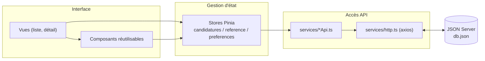

# Document Technique — Test Technique Vue.js

Ce document suit la progression du test technique, partie par partie, en suivant l'ordre imposé par `test-technique-vuejs.md`.

Ce que couvre ce document par rapport à ce qui est demandé :
- Architecture des composants → section "Architecture" juste en dessous
- Stratégie de communication avec l'API REST → section "Couche API" de la Partie 2
- Gestion de l'état et synchronisation avec JSON Server → section "Stores Pinia" de la Partie 2
- Décisions techniques et pourquoi → section "Choix techniques" de chaque partie
- Problèmes rencontrés et solutions → section "Points d'attention rencontrés" de chaque partie
- Points d'amélioration → "Limites et améliorations possibles" (README) et "Pistes d'amélioration futures" en bas de ce document

---

## Architecture



Les vues et composants ne parlent jamais directement à l'API : ils lisent/écrivent dans les stores Pinia, qui eux-mêmes passent par la couche `services/`. Ça permet de mocker facilement les appels API dans des tests (question bonus n°4) sans toucher aux composants.

---

## Partie 0 — Configuration de l'environnement

### Ce qui était demandé

1. Installer JSON Server
2. Lancer l'API REST avec `json-server --watch db.json --port 3000`
3. Vérifier que l'API fonctionne (`http://localhost:3000` et `http://localhost:3000/candidatures`)

### Ce qui a été fait

| # | Action | Détail |
|---|--------|--------|
| 1 | Création du projet Vue 3 | `npm create vite@5 . -- --template vue-ts` → Vue 3 + TypeScript + Vite |
| 2 | Installation des dépendances obligatoires | `json-server`, `concurrently`, `axios`, `pinia`, `vue-router` |
| 3 | Ajout de scripts npm | `api` (JSON Server seul), `start` (API + app en parallèle via `concurrently`) |
| 4 | Lancement de l'API | `json-server --watch db.json --port 3000` |
| 5 | Vérification des endpoints | `/candidatures`, `/statuts`, `/postes` → 200 OK avec les données réelles |
| 6 | Vérification des query params | Filtre `?statut=`, recherche `?q=`, pagination `?_page&_limit` (header `X-Total-Count`) → tous fonctionnels |
| 7 | Sauvegarde de sécurité | Copie de `db.json` vers `db.backup.json` (JSON Server réécrit `db.json` en direct lors des PATCH/POST/DELETE) |

### Choix techniques et justifications

- **`create-vite@5` au lieu de la dernière version** : la version Node installée (18.18.2) est trop ancienne pour `create-vite` latest, qui exige Node ≥ 20.19. La v5 reste pleinement compatible avec Vue 3 + Vite 5.
- **`vue-router@4` au lieu de la v5** : `vue-router@5` exige Vite 7/8 en peer dependency, incompatible avec Vite 5 utilisé ici (lui-même choisi pour la compatibilité Node 18). La v4 est la version stable et éprouvée pour Vue 3.
- **`json-server@0.17.4`** (et non la v1, réécriture plus récente et moins documentée) : c'est la version dont le comportement correspond aux exemples et query params décrits dans le sujet (`_page`, `_limit`, `_sort`, `_order`, `?q=`).

### Points d'attention rencontrés

- `npm install` a échoué une première fois avec l'erreur interne `Cannot read properties of null (reading 'edgesOut')` — bug connu de npm 9.8.1 dans la résolution des peer dependencies. Contourné avec l'option `--legacy-peer-deps`.
- `http://localhost:3000` (racine) renvoie `{}` avec un statut 404 au lieu d'une page HTML de documentation. **Sans impact** : c'est un comportement cosmétique de cette version de JSON Server ; tous les endpoints de données (`/candidatures`, `/statuts`, `/postes`, `/competences`) répondent correctement.

### Vérification (résultat des tests manuels)

```
GET http://localhost:3000/candidatures       → 200 OK, 12 candidatures
GET http://localhost:3000/statuts            → 200 OK, 5 statuts
GET http://localhost:3000/postes             → 200 OK, 4 postes
GET /candidatures?statut=En attente          → 200 OK, filtré correctement
GET /candidatures?q=Vue.js                   → 200 OK, recherche full-text fonctionnelle
GET /candidatures?_page=1&_limit=2           → 200 OK, header X-Total-Count: 12
```

### Temps passé

~20 minutes (installation classique + un souci de compatibilité npm/Node à régler)

---

## Partie 1 — Analyse et Diagnostic

### Ce qui était demandé

Analyser les problèmes typiques des recruteurs (volume de candidatures, filtrage, collaboration entre recruteurs, suivi du parcours candidat) et documenter l'approche technique pour les résoudre.

### Problématique 1 — Volume important de candidatures à traiter

**Constat :** même avec seulement 12 candidatures dans `db.json`, on imagine qu'en production ce nombre peut monter à plusieurs centaines. Charger et afficher tout d'un coup ralentit la page et noie le recruteur sous l'information.

**Approche technique :**
- Pagination côté serveur via `_page` et `_limit` de JSON Server (on ne charge jamais toutes les candidatures en mémoire d'un coup)
- Tri côté serveur via `_sort` / `_order` (ex: les plus récentes en premier par défaut)
- Affichage en liste compacte (nom, poste, statut, date) plutôt que toutes les infos d'un coup — le détail complet n'est chargé qu'au clic (`GET /candidatures/:id`)

### Problématique 2 — Filtrer rapidement par compétences, expérience, statut

**Constat :** les recruteurs doivent croiser plusieurs critères en même temps (ex: "Vue.js" + "Entretien RH" + expérience "3 ans"). Un seul filtre à la fois serait insuffisant.

**Approche technique :**
- Filtres combinables construits comme query params JSON Server (`?statut=...&poste=...`), cumulés dans l'URL/état pour permettre le partage d'un lien de recherche
- Recherche full-text en temps réel via `?q=` (avec **debounce** ~300ms pour éviter de spammer l'API à chaque frappe)
- Filtre par compétence traité côté client après récupération (JSON Server ne filtre pas nativement dans un tableau `competences[]`), en combinant avec les autres filtres serveur
- Filtres actifs persistés dans Pinia + `localStorage`, pour que le recruteur retrouve sa recherche en rouvrant l'app

### Problématique 3 — Collaboration entre plusieurs recruteurs

**Constat :** dans `db.json`, on voit déjà plusieurs intervenants sur une même candidature (`Marie Recruteuse`, `Pierre Tech Lead`, `CTO`) qui commentent à des dates différentes. Sans traçabilité claire, deux recruteurs risquent de se marcher dessus (statut changé en double, information perdue).

**Approche technique :**
- Chaque commentaire garde son **auteur** et sa **date** (`PATCH /candidatures/:id` en ajoutant à `commentaires[]`), affichés en fil chronologique dans la vue détail
- **Optimistic UI update** : le changement de statut s'affiche immédiatement dans l'interface, puis se confirme (ou s'annule avec message d'erreur) après la réponse de l'API — évite la sensation de lenteur en usage multi-utilisateur
- Piste non implémentée faute de temps : historiser automatiquement les changements de statut sous forme de commentaire système (voir "Limites et améliorations possibles")

### Problématique 4 — Suivi du parcours de chaque candidat

**Constat :** un candidat passe par plusieurs statuts (`En attente` → `Entretien RH` → `Entretien technique` → `Accepté`/`Refusé`, cf. `ordre` dans `statuts`). Il faut visualiser où en est chaque candidat sans devoir rouvrir chaque fiche.

**Approche technique :**
- Statut affiché avec un badge coloré directement dans la liste (couleur définie dans `statuts.couleur`, triée par `statuts.ordre`)
- Vue détail présentant une **timeline verticale** : date de candidature → commentaires → statut actuel, dans l'ordre chronologique
- (Bonus Mid-Level) Vue kanban avec une colonne par statut et drag & drop pour changer le statut visuellement

### Temps passé

~35 minutes

---

## Partie 2 — Développement de l'Interface

### Ce qui était demandé

Récupération des données via l'API (candidatures, statuts, postes) avec loading/erreurs, liste avec filtres/recherche/pagination, détail avec changement de statut et ajout de commentaire, gestion d'état Pinia avec persistance des préférences.

### Ce qui a été fait

| Bloc | Détail |
|---|---|
| Couche API | `services/http.ts` (instance axios + normalisation des erreurs), `candidaturesApi.ts`, `referenceApi.ts` — aucun composant n'appelle axios directement |
| Stores Pinia | `candidatures` (liste, détail, kanban), `reference` (statuts/postes/compétences, chargés une fois puis mis en cache), `preferences` (filtres, tri, thème, vue liste/kanban, persistés en `localStorage`) |
| Liste | Recherche `?q=` avec debounce 300ms, filtres combinés (statut, poste, compétence, période), tri `_sort`/`_order`, pagination `_page`/`_limit` |
| Détail | Page dédiée `/candidatures/:id`, changement de statut et ajout de commentaire en `PATCH`, tous les deux en optimistic update avec rollback si l'API échoue |
| Vue Kanban | Une colonne par statut, drag & drop HTML5 natif pour changer le statut d'une candidature |
| UI | Skeleton loaders, bandeaux d'erreur avec retry, mode sombre, transitions de page |

### Bonus Mid-Level traités

Mode sombre, optimistic UI updates, drag & drop kanban, animations (transitions + skeleton), persistance des préférences (filtres et vue).

### Bonus non traités

Tests unitaires, système de notifications/alertes, cache avancé avec invalidation (seul un cache simple existe pour les données de référence).

### Points d'attention rencontrés

- Filtre par compétence : JSON Server ne filtre pas un champ tableau via ses query params, donc ce filtre est appliqué côté client après récupération d'un lot de candidatures (voir "Limites et améliorations possibles")
- Confusion initiale sur la pagination (12 candidatures au total, 10 affichées par page) : réglée en gardant `_limit=10` (conforme à l'exemple du sujet) et en ajoutant un compteur total bien visible dans l'interface
- Le premier design du filtre de date (deux champs "Du"/"Au" bruts) prenait trop de place et cassait la mise en page de la barre de recherche — remplacé par un sélecteur unique avec raccourcis ("7 derniers jours", "30 derniers jours", "ce mois-ci") et période personnalisée dans un panneau déroulant

### Temps passé

~4 heures

---

## Partie 3 — Qualité du Code

### Ce qui était demandé

Composants réutilisables, props/events propres, Composition API, responsive mobile-first, accessibilité de base, nommage clair, gestion d'erreurs robuste.

### Ce qui a été fait

- Composants découpés par responsabilité (cartes, filtres, pagination, kanban, formulaires...), aucun composant ne dépasse une seule responsabilité claire
- Props et events typés en TypeScript sur tous les composants
- Composition API partout (`<script setup>`), pas d'Options API
- Responsive : grille en `auto-fill` qui s'adapte à la largeur d'écran, filtres qui passent à la ligne sur mobile, Kanban en scroll horizontal sur petit écran
- Accessibilité de base : labels sur tous les champs, `aria-live` sur le loader, `aria-pressed` sur le toggle mode sombre, `aria-busy` pendant le chargement de la liste, navigation clavier native (select/input/button/lien) sans piège au focus
- Gestion d'erreurs centralisée (`getErrorMessage`) qui distingue réseau coupé, timeout, 404 et 500, avec message utilisateur adapté à chaque cas

### Points d'amélioration identifiés

- Pas de vérification exhaustive au clavier ni avec un lecteur d'écran (juste les attributs ARIA de base)
- L'idée d'historiser les changements de statut comme des commentaires système (notée en Partie 1) n'a pas été implémentée

### Temps passé

~45 minutes

---

## Questions Bonus (Entretien Technique)

Le sujet propose 6 questions à préparer pour l'entretien. Voici mes réponses, basées sur ce que j'ai vraiment codé dans ce projet.

### 1. Comment gérer 10 000 candidatures côté front ?

Le plus important c'est de jamais tout charger d'un coup en mémoire. Dans mon appli je charge déjà par page avec `_page` et `_limit`, donc même avec 10 000 candidatures le navigateur n'en voit que 10 à la fois. Si on veut afficher une longue liste sans pagination classique, il y a la virtualisation (n'afficher que ce qui est visible à l'écran), mais je ne l'ai pas mise en place ici. Et j'essaie de filtrer/trier côté serveur plutôt que de tout récupérer et filtrer en JS — sauf pour les compétences, où je suis obligé de filtrer côté client parce que JSON Server ne sait pas filtrer dans un tableau.

### 2. Quelle stratégie pour le temps réel ?

Là je suis honnête, je n'ai pas fait de vrai temps réel, l'appli se met à jour seulement quand on clique quelque part. Si je devais le faire, je pense à des WebSockets pour prévenir les autres recruteurs quand un statut change. Sinon plus simple : un petit polling toutes les X secondes. Le truc auquel j'ai pensé mais que je n'ai pas résolu : si deux recruteurs changent le statut en même temps, rien n'empêche d'écraser l'action de l'autre.

### 3. Comment optimiser les appels API ?

J'ai mis en cache les données qui bougent pas souvent, comme les statuts et les postes : chargées une seule fois au démarrage et gardées dans le store. Pour les candidatures, quand je change un statut ou j'ajoute un commentaire, je mets à jour direct l'affichage sans refaire un appel GET après, ça évite un aller-retour inutile. Sur un vrai projet plus gros, j'utiliserais sûrement une librairie comme TanStack Query qui gère tout ça toute seule.

### 4. Comment tester des composants qui font des appels API ?

L'idée c'est de jamais appeler la vraie API dans un test. Comme j'ai mis tous les appels axios dans un dossier `services/` à part, les composants n'appellent jamais axios eux-mêmes, donc c'est facile de mocker juste ce fichier avec Vitest. Je testerais aussi les stores Pinia tout seuls avec des fausses réponses. Il y a aussi des outils comme MSW qui interceptent carrément les requêtes réseau, ce serait plus réaliste, mais j'ai pas eu le temps de le mettre en place ici.

### 5. Accessibilité, tes priorités ?

J'ai fait les trucs de base : des labels sur tous les champs, un `aria-live` sur le loader pour qu'il soit annoncé, et tout se navigue au clavier normalement parce que j'utilise de vrais éléments HTML (select, button, input) plutôt que des divs cliquables. Par contre je sais que mon Kanban avec le glisser-déposer marche qu'à la souris — c'est un vrai trou, il faudrait un moyen de changer le statut au clavier aussi.

### 6. Comment gérer des états de chargement complexes ?

J'ai séparé les loadings selon ce qui charge : un pour la liste, un autre pour la fiche détail, et des loadings à part pour les actions (changer le statut, ajouter un commentaire). Comme ça une action bloque pas toute la page. Un truc que j'ai pas géré : si on tape vite dans la recherche, rien n'empêche qu'une vieille réponse arrive après la nouvelle et affiche des résultats faux. Il faudrait annuler la requête précédente avec un `AbortController`.

---

## Pistes d'amélioration futures

En plus des limites déjà notées dans le README, quelques idées qui sortent du cadre du sujet mais qui auraient du sens pour un vrai outil de recrutement :

- **Bot de matching par critères** : le recruteur donne ses critères (compétences recherchées, expérience minimale, poste...) et un système cherche dans les candidatures pour proposer un classement des meilleurs profils, plutôt que de filtrer/trier manuellement
- **Tri et filtre par années d'expérience** : actuellement `experience` est un texte libre ("3 ans", "1.5 ans"...) dans `db.json`, il faudrait le normaliser en nombre pour permettre un vrai filtre par plage (ex: "2 à 5 ans")
- **Tableau de bord analytics** : temps moyen passé par statut, taux de conversion entre chaque étape du pipeline — ça répondrait directement à la problématique de suivi du parcours candidat identifiée en Partie 1
- **Export CSV/Excel** de la liste filtrée, pour partager une sélection avec l'équipe ou faire un reporting hors de l'application

---

## Déploiement

Démo en ligne : [gestion-candidatures.vercel.app](https://gestion-candidatures.vercel.app), API sur [gestion-candidatures-api.onrender.com](https://gestion-candidatures-api.onrender.com/candidatures).

- **Frontend** : Vercel, connecté directement au dépôt GitHub, build automatique (`npm run build`) à chaque push sur `main`
- **API** : Render (plan gratuit), qui lance `npm run start:api` (JSON Server en écoutant sur le port fourni par Render au lieu du port 3000 fixe utilisé en local)

**Problème rencontré :** première tentative avec [my-json-server.typicode.com](https://my-json-server.typicode.com), un service gratuit qui transforme le `db.json` d'un repo GitHub en API sans rien déployer. Ça a échoué avec une erreur `maxContentLength size of 10000 exceeded` : ce service récupère le fichier via l'API GitHub, qui l'encode en base64 (+33% de taille), et notre `db.json` dépassait la limite de 10 Ko une fois encodé. Impossible de le faire rentrer dans la limite sans supprimer des candidatures, ce qui aurait changé les données fournies par le sujet.

**Solution retenue :** déployer un vrai JSON Server sur Render, qui n'a aucune limite de ce type et garde toutes les fonctionnalités (PATCH, filtres, etc.) avec les données complètes.

**Limite du plan gratuit Render :** le service s'endort après 15 minutes sans requête et met 30 à 50 secondes à redémarrer au premier appel suivant. Sans impact sur le fonctionnement, juste un temps de chargement plus long au premier essai.
