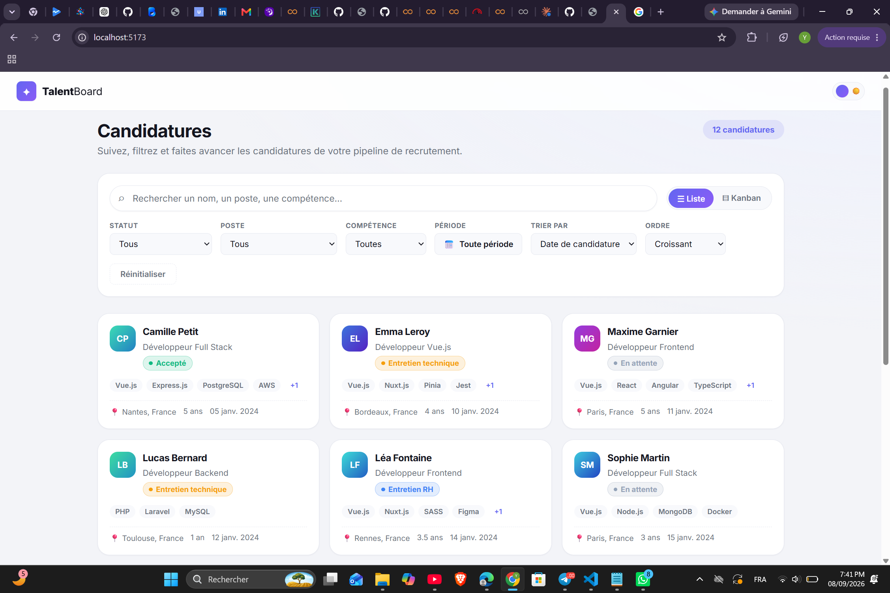
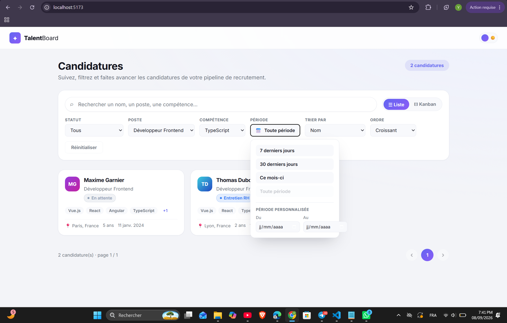
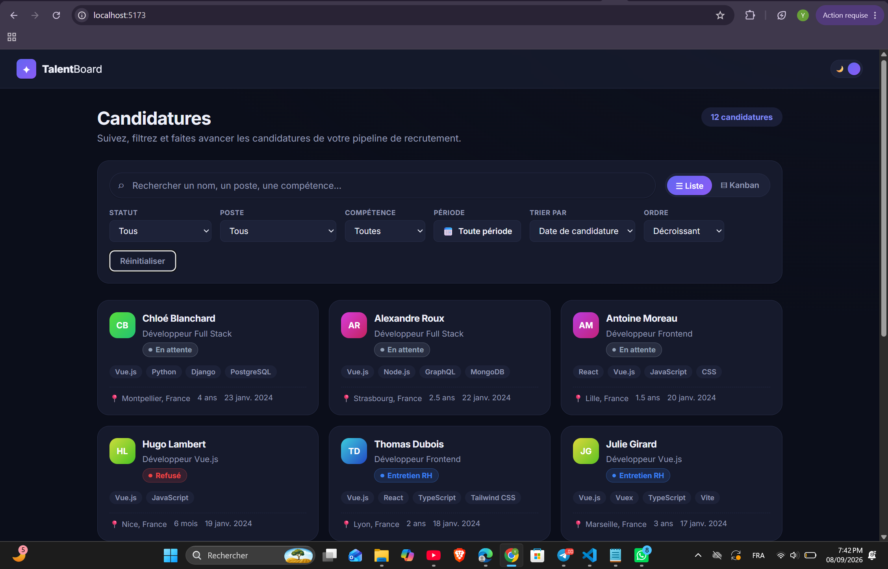
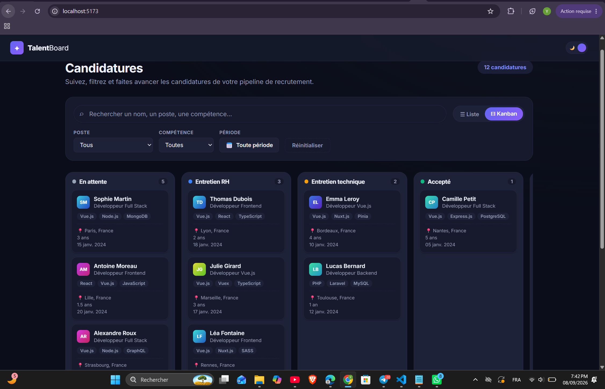
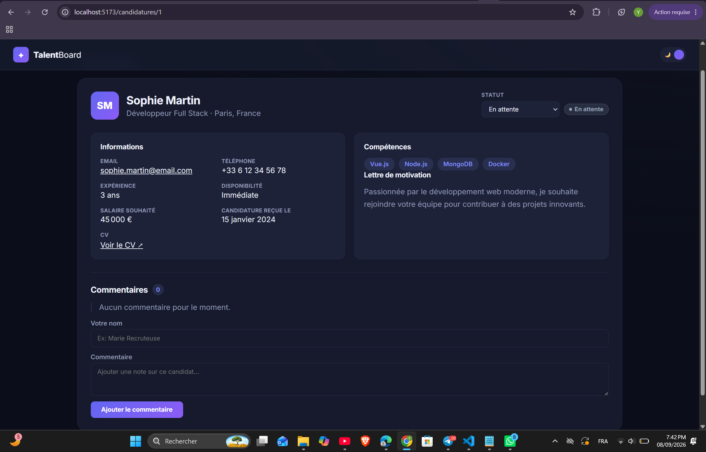

# TalentBoard — Gestion des candidatures

Test technique Vue.js (Junior/Mid-Level) : interface de gestion de candidatures pour une équipe de recrutement. L'énoncé original est dans [`docs/enonce/`](docs/enonce/test-technique-vuejs.md).

**Démo en ligne** : [gestion-candidatures.vercel.app](https://gestion-candidatures.vercel.app)
API hébergée : [gestion-candidatures-api.onrender.com](https://gestion-candidatures-api.onrender.com/candidatures)

> L'API est sur le plan gratuit de Render : elle s'endort après 15 min d'inactivité et met 30-50 secondes à se réveiller au premier appel. Patience au premier chargement.

## Sommaire

- [Stack technique](#stack-technique)
- [Installation](#installation)
- [Lancer le projet](#lancer-le-projet)
- [Scripts disponibles](#scripts-disponibles)
- [Fonctionnalités](#fonctionnalités)
- [Structure du projet](#structure-du-projet)
- [Choix techniques](#choix-techniques)
- [Captures d'écran](#captures-décran)
- [Temps passé](#temps-passé)
- [Limites et améliorations possibles](#limites-et-améliorations-possibles)

## Stack technique

- Vue 3 (Composition API, `<script setup>`)
- TypeScript
- Vite 5
- Pinia (état global + préférences persistées en `localStorage`)
- Vue Router 4
- Axios
- JSON Server (`db.json` fourni par l'énoncé)
- CSS natif avec variables (pas de framework CSS)

Toutes les données viennent de l'API JSON Server, rien n'est codé en dur dans le code.

## Installation

```bash
git clone <url-de-ce-dépôt>
cd seg
npm install
cp .env.example .env
```

`.env` ne contient que l'URL de l'API :

```
VITE_API_BASE_URL=http://localhost:3000
```

## Lancer le projet

API + app en même temps :

```bash
npm run start
```

Ou séparément, dans deux terminaux :

```bash
npm run api   # JSON Server sur http://localhost:3000
npm run dev   # App Vue sur http://localhost:5173
```

Pour vérifier que l'API tourne : [http://localhost:3000/candidatures](http://localhost:3000/candidatures).

> JSON Server réécrit `db.json` à chaque modification (changement de statut, ajout de commentaire). `db.backup.json` garde une copie des données d'origine si besoin de repartir de zéro (`cp db.backup.json db.json`).

## Scripts disponibles

| Commande | Description |
|---|---|
| `npm run dev` | Serveur de dev Vite |
| `npm run api` | JSON Server sur le port 3000 |
| `npm run start` | API + app en parallèle |
| `npm run build` | Type-check puis build de production |
| `npm run preview` | Prévisualise le build |

## Fonctionnalités

- Liste des candidatures : recherche en temps réel (debounce 300ms), filtres combinables (statut, poste, compétence, période), tri, pagination via `_page`/`_limit`
- Vue Kanban : une colonne par statut, drag & drop pour changer le statut d'une candidature (avec rollback si l'API renvoie une erreur)
- Détail d'une candidature : changement de statut et ajout de commentaires (mise à jour optimiste)
- Mode sombre, filtres actifs et vue préférée (liste/kanban) persistés
- Loading states (skeleton) et gestion des erreurs réseau avec retry

## Structure du projet

```
src/
 ├─ components/    Composants réutilisables (cartes, filtres, pagination, kanban...)
 ├─ views/         Pages (liste, détail, 404)
 ├─ stores/        Pinia : candidatures, référentiels (statuts/postes/compétences), préférences
 ├─ services/      Appels API (client axios, candidaturesApi, referenceApi)
 ├─ composables/   Logique réutilisable (debounce)
 ├─ utils/         Fonctions utilitaires (avatars)
 ├─ types/         Types TypeScript partagés
 └─ router/        Config Vue Router
```

## Choix techniques

- **`create-vite@5` au lieu de la dernière version** : la dernière exige Node ≥ 20.19, la machine de dev tourne en Node 18.18.
- **`vue-router@4` au lieu de la v5** : la v5 demande Vite 7/8 en peer dependency, incompatible avec Vite 5.
- **Filtre par compétence côté client** : JSON Server ne filtre pas nativement un champ tableau (`competences: string[]`). Les autres filtres (statut, poste, recherche, période) passent par les query params de l'API comme demandé.
- **Drag & drop en HTML5 natif** : pas de librairie tierce pour cette fonctionnalité bonus, plus simple à maintenir.
- **3 stores Pinia séparés** : `candidatures` (données mutables), `reference` (statuts/postes/compétences, chargés une fois et mis en cache), `preferences` (filtres, thème, vue, persistés en localStorage).

## Captures d'écran

| Liste (clair) | Filtre par période |
|---|---|
|  |  |

| Liste (sombre) | Kanban |
|---|---|
|  |  |

| Détail candidature |
|---|
|  |

## Temps passé

| Partie | Estimé par le sujet | Temps réel |
|---|---|---|
| Partie 0 — Configuration | 15 min | ~20 min (petit souci de compatibilité Node à régler) |
| Partie 1 — Analyse et diagnostic | 30-45 min | ~35 min |
| Partie 2 — Développement de l'interface | 2-3 h | ~4 h (avec les bonus : kanban, dark mode, optimistic updates) |
| Partie 3 — Qualité du code | 1 h | ~45 min |

Total : environ 5h40. Détail des choix et difficultés dans [`DOCUMENTATION-TECHNIQUE.md`](DOCUMENTATION-TECHNIQUE.md).

## Limites et améliorations possibles

- Le filtre compétence n'utilise pas les query params JSON Server (limitation technique expliquée plus haut) — à revoir si l'API évolue ou si on passe sur une vraie base de données
- Vue Kanban pas paginée (charge jusqu'à 500 candidatures) — suffisant ici mais à revoir pour un vrai volume
- Pas de tests unitaires pour l'instant
- Pas de système de notifications globales, juste des messages d'erreur inline
- Pas d'authentification, le nom de l'auteur d'un commentaire est saisi librement
